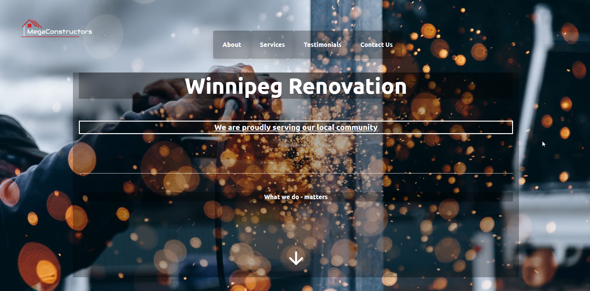
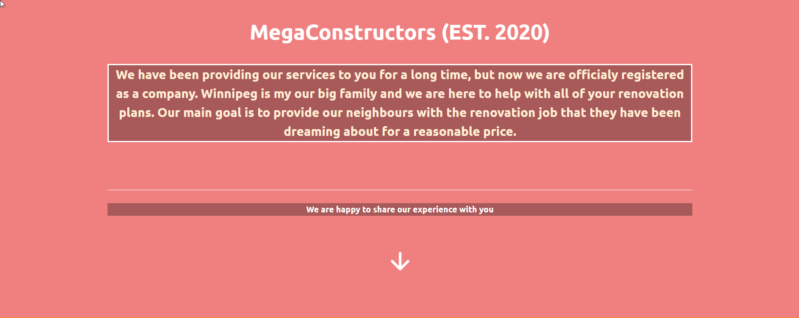
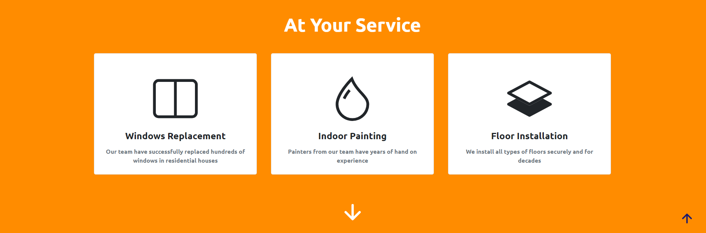
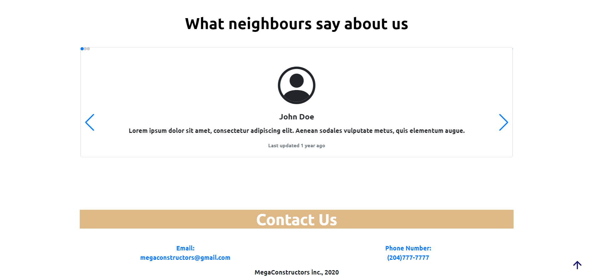
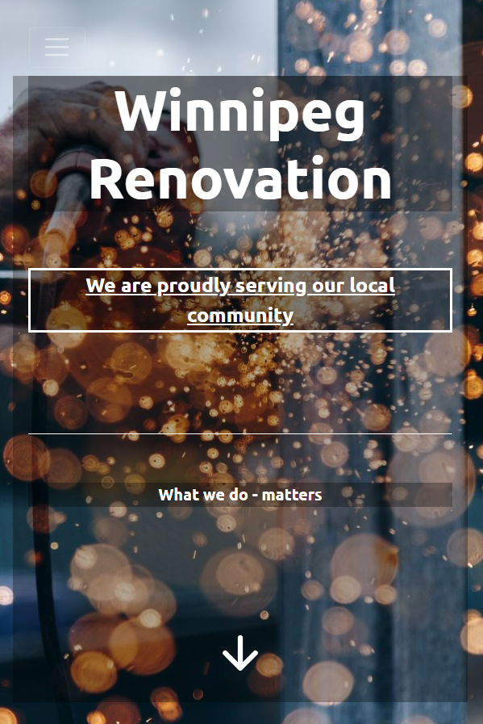
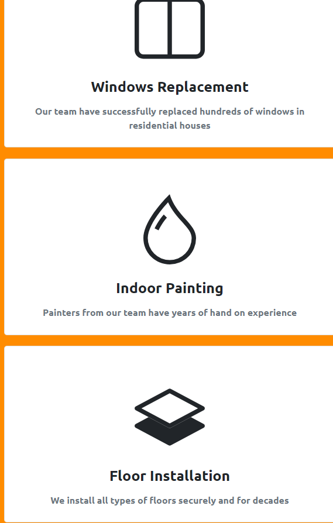

# README.md
<h1> Construction website for local business: </h1>

It is created to be responsive on both PC and mobile devices;

- Technologies used: (Html, CSS, Javascript, JQuery, BootStrap)

- Animations are used in order to enhance user experience;

<h2> Here is the list of screenshots of the Desktop version: </h2>

- Down arrow used to simplify scrolling for user;

- Up arrow used to simplify scrolling for user, it appears after user scrolls through a certain point on the page;

<h2> Here is the list of screenshots of the Mobile version: </h2>

- As you can see text adjusted according to the size of the screen

	

- Mobile menu replaces desktop one after a certain point

	

- Cards(boxes) with data are aligned one under another one to fit the device screen in a user-friendly way

	

